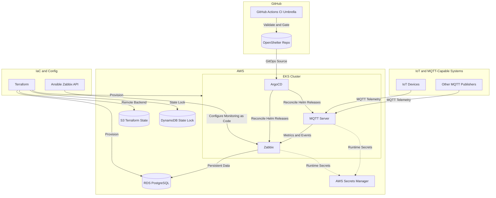

# OpenShelter

OpenShelter is a cloud-native monitoring platform built around Zabbix and MQTT.

The project is designed to monitor IoT devices and any systems that can publish telemetry through MQTT, while maintaining a resilient and auditable operations model.

## Platform Goals
- Centralize monitoring for MQTT-capable devices and services
- Keep infrastructure reproducible and environment-aware (`dev`, `stg`, `prod`)
- Enforce immutable deployments and GitOps reconciliation
- Apply SRE practices (SLO/SLI, runbooks, incident response)
- Keep secrets out of Git with secure runtime handling

## Core Architecture
- **Monitoring Engine:** Zabbix (containerized workload)
- **Message Ingestion:** MQTT server (containerized workload)
- **Cloud Runtime:** AWS EKS
- **Persistent Data:** AWS RDS PostgreSQL (managed outside Kubernetes)
- **Infrastructure as Code:** Terraform with S3 + DynamoDB remote state
- **Config Management:** Ansible for Zabbix API-driven configuration
- **GitOps Delivery:** Helm + ArgoCD App-of-Apps
- **CI/CD:** GitHub Actions umbrella workflow

## Architecture Diagram

	### Legend
	- **IoT and MQTT-Capable Systems:** telemetry producers that publish MQTT messages.
	- **MQTT Server (EKS):** ingestion endpoint for device and system telemetry.
	- **Zabbix (EKS):** monitoring engine for metric/event processing, trigger evaluation, and alert generation.
	- **RDS PostgreSQL:** persistent monitoring data store managed outside Kubernetes.
	- **AWS Secrets Manager:** source of truth for secret values used at runtime.
	- **ArgoCD:** GitOps reconciler that applies desired Kubernetes state from Git.
	- **Helm:** reusable deployment template layer consumed by ArgoCD applications.
	- **Terraform:** infrastructure provisioning layer for AWS resources and state backend.
	- **Ansible (Zabbix API):** monitoring configuration automation as code.
	- **GitHub Actions CI Umbrella:** validation and policy gates before deployment changes are promoted.

	### Data Plane vs Control Plane
	- **Data Plane:** IoT/MQTT telemetry ingestion and monitoring data processing (`IoT devices -> MQTT -> Zabbix -> RDS`).
	- **Control Plane:** provisioning, deployment, policy, and configuration automation (`Terraform`, `ArgoCD`, `Helm`, `Ansible`, and `GitHub Actions`).

## Structure
- `platform/terraform`: bootstrap, modules, and environments
- `platform/gitops`: ArgoCD and Helm
- `config`: centralized global and per-environment configuration
- `apps`: containerized workloads (zabbix and mqtt)
- `ops/ansible`: automation via Zabbix API
- `scripts`: operational scripts (including ArgoCD bootstrap)
- `.github/workflows`: validation and delivery pipelines
- `docs/adr`: architecture decision records
- `docs/sre`: runbooks, SLO/SLI, and operations
- `security/policies`: security baseline

## Principles
1. State outside Kubernetes
2. Workload immutability
3. Secrets outside Git
4. Pull request-based promotion

## Monitoring Flow
1. IoT devices and systems publish telemetry to MQTT topics.
2. MQTT data is consumed by monitoring integrations.
3. Zabbix processes metrics/events and evaluates triggers.
4. Alerts and operational actions follow SRE runbooks and incident workflows.

## GitOps Deployment Model
- ArgoCD reconciles desired state from this repository.
- A root application manages child applications per environment.
- Helm chart templates are shared, while values are environment-specific.
- Environment values are stored in:
	- `platform/gitops/helm/values/dev/openshelter-stack.yaml`
	- `platform/gitops/helm/values/stg/openshelter-stack.yaml`
	- `platform/gitops/helm/values/prod/openshelter-stack.yaml`

## Security Model (Baseline)
- No secrets in source code, Terraform tfvars, or Helm values in Git.
- Preferred secret source: AWS Secrets Manager.
- Kubernetes Secrets are runtime delivery artifacts only.
- Access is controlled with least-privilege IAM/RBAC and audited.

## Quick start
0. Prepare local tooling (Linux): `make bootstrap-linux` (or `SKIP_DOCKER=true make bootstrap-linux` if Docker is managed externally).
1. Set central configuration values in `config/global.env` and `config/env/{dev,stg,prod}.env`.
	- Versioned defaults in `config/global.env`: `AWS_REGION`, `TF_STATE_KEY_PREFIX`, chart versions, repository metadata.
	- Local-only overrides (not versioned): create `config/local.env` for `AWS_ACCOUNT_ID`, `TF_STATE_BUCKET`, `TF_LOCK_TABLE` (and optional `TF_STATE_KEY_PREFIX`).
	- Required in each `config/env/*.env`: `ENV`, `CLUSTER_NAME`, `VPC_CIDR`, `RDS_HOST` (and optional `TF_STATE_KEY`).
2. Configure AWS credentials with least-privilege permissions.
3. Run Terraform backend bootstrap in `platform/terraform/bootstrap`.
4. Inspect loaded config (`make show-config ENV=dev`).
5. Render environment artifacts from central config (`make render-config`) — this generates `backend.hcl` per Terraform environment and updates environment Helm values with `RDS_HOST`.
6. On the first environment apply only, provide the three bootstrap secrets explicitly (`rds_password`, `zabbix_admin_password`, `mqtt_password`). After the secrets exist in AWS Secrets Manager, normal `plan`/`apply` runs can omit them and Terraform will reuse the current stored values instead of rotating them.
7. Plan Terraform for one environment (`make terraform-env-plan ENV=dev`).
8. Validate charts and checks (`make validate` and `make config-check`).
9. Bootstrap ArgoCD objects (`make argocd-bootstrap ENV=dev`).

### Secret Rotation Safety
- Default behavior: no password rotation on routine Terraform runs.
- First apply for a brand-new environment: pass the three secret variables explicitly.
- Routine applies for an existing environment: omit those variables so Terraform reuses the current values from AWS Secrets Manager.
- Intentional rotation: first update the target secret values in AWS Secrets Manager, then run Terraform for the environment so infrastructure converges to the new values.

## Quality Gates
- English-only repository policy check
- Terraform formatting and validation (`bootstrap`, `dev`, `stg`, `prod`)
- Helm linting
- Ansible playbook syntax validation
- Config consistency check for legacy region literals (`make config-check`)

## GitHub Actions Configuration Contract
- Repository/Environment Variables (`vars`):
	- `AWS_REGION`
	- `AWS_ACCOUNT_ID`
	- `TF_STATE_BUCKET`
	- `TF_LOCK_TABLE`
	- `TF_STATE_KEY_PREFIX`
- Repository/Environment Secrets (`secrets`):
	- `TF_PLAN_ROLE_ARN`
	- `ECR_PUSH_ROLE_ARN`
- Derived in CI (no secret needed):
	- `ECR_REGISTRY = ${AWS_ACCOUNT_ID}.dkr.ecr.${AWS_REGION}.amazonaws.com`
- Recommendation: use GitHub Environments (`dev`, `stg`, `prod`) with approvals/protection rules for production values.

### GitHub Hardening Checklist
- Create GitHub Environments used by workflow jobs:
	- `dev` (used by `terraform-plan`)
	- `prod` (used by `docker-build-push`)
- Restrict who can deploy to `prod` environment (required reviewers / admins only).
- Configure environment-scoped vars/secrets (prefer over repository-wide values for sensitive environments).
- Enable branch protection for `main`:
	- Require pull request before merge
	- Require status checks to pass (`language-check`, `terraform-check`, `helm-lint`, `ansible-syntax`)
	- Restrict who can push directly to `main`
- Protect `.github/workflows/*` changes via CODEOWNERS/review policy.

### CI Rollout Checklist (Item 6)
1. Configure Variables (`Settings` -> `Secrets and variables` -> `Actions` -> `Variables`):
	- `AWS_REGION`
	- `AWS_ACCOUNT_ID`
	- `TF_STATE_BUCKET`
	- `TF_LOCK_TABLE`
	- `TF_STATE_KEY_PREFIX`
2. Configure Secrets (`Settings` -> `Secrets and variables` -> `Actions` -> `Secrets`):
	- `TF_PLAN_ROLE_ARN`
	- `ECR_PUSH_ROLE_ARN`
3. Prefer Environment-level values for `dev` and `prod` (instead of only repository-level).
4. Validate PR path:
	- Open a PR from an internal branch.
	- Confirm `terraform-plan` runs in `dev` environment and posts plan comment.
5. Validate main path:
	- Merge PR into `main`.
	- Confirm `docker-build-push` runs in `prod` environment, builds/pushes images, and updates Helm tags.
6. Validate fail-fast behavior:
	- Temporarily remove one required variable in a non-production test repo/environment.
	- Confirm workflow fails early with `Missing required CI configuration`.
7. Keep auditability:
	- Use `workflow_dispatch` for controlled/manual execution.
	- Record first successful run URLs in release/change notes.

## ADRs and Operational Docs
- Architecture decisions are tracked in `docs/adr`.
- Reliability and incident process baselines are tracked in `docs/sre`.
- Security controls and policies are tracked in `security/policies`.

## Status
Foundational scaffolding is in place.

Next iterations include production-grade chart templates, Zabbix API automation expansion, and environment hardening for EKS and RDS.
